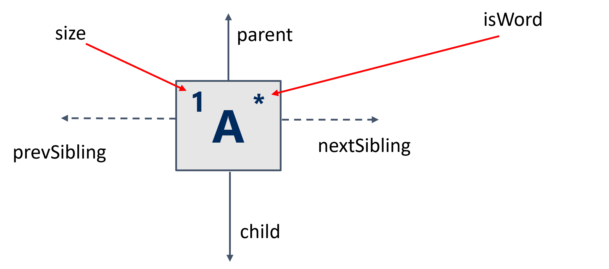
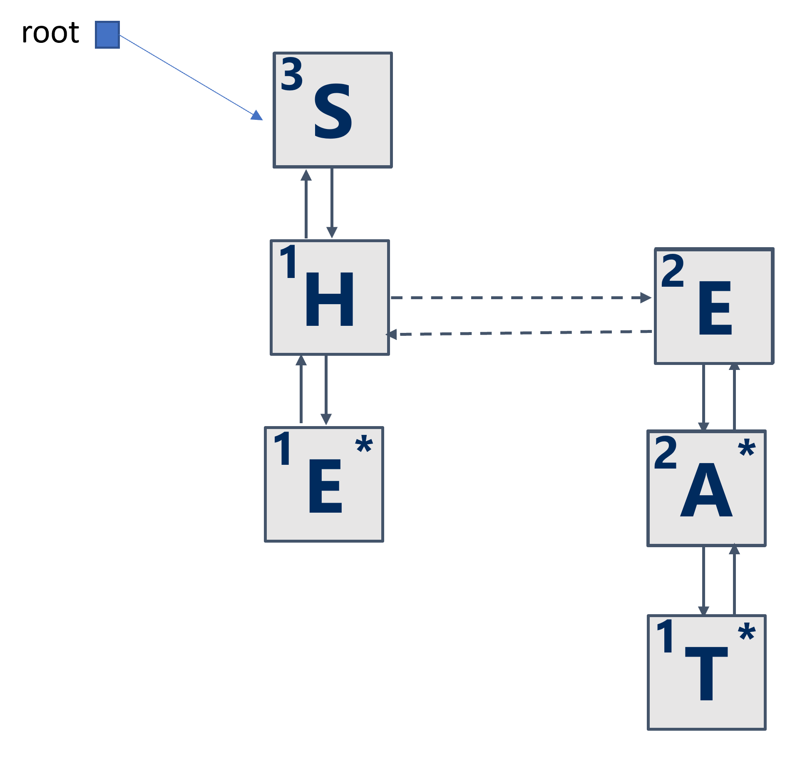
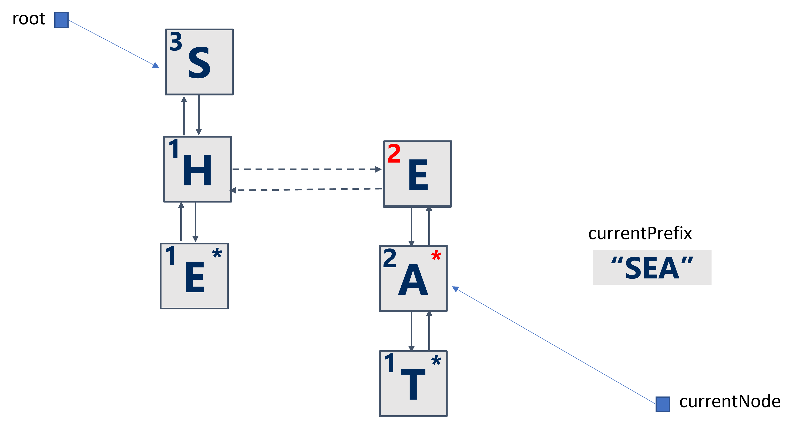
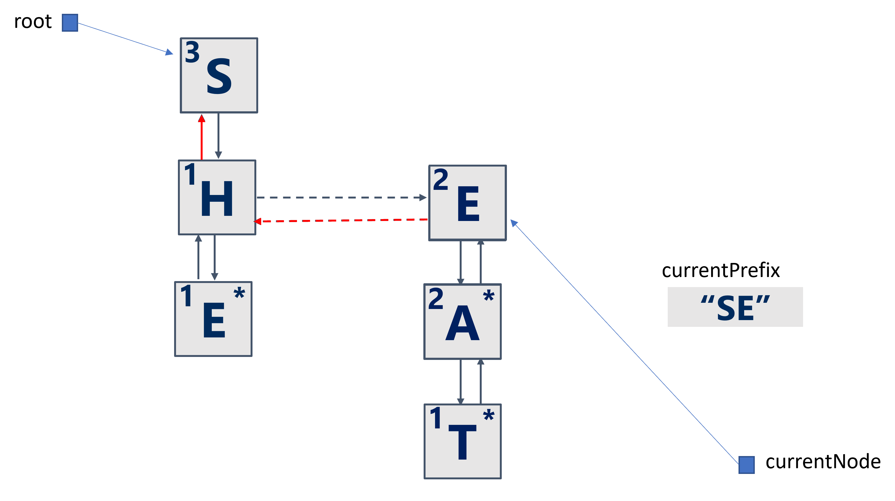
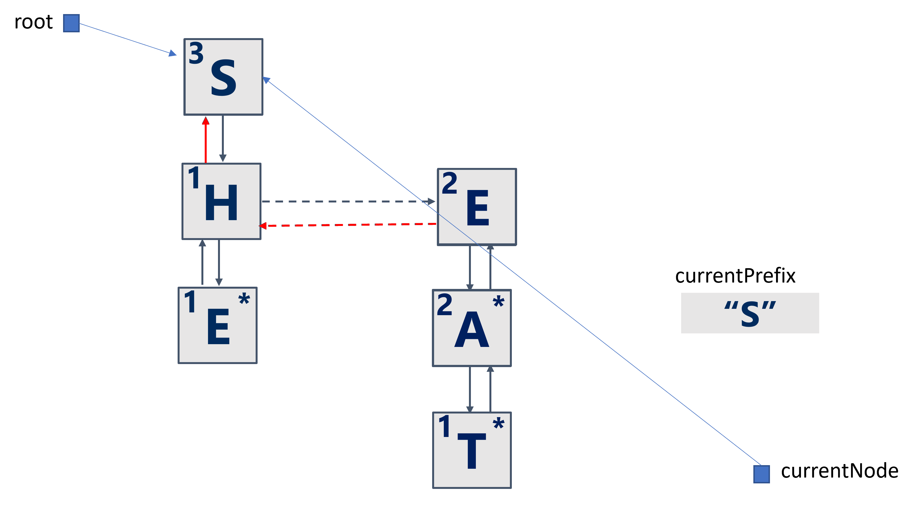

# CS 1501 – Algorithm Implementation – Assignment #2

Due: Monday, March 4th @ 11:59pm on Gradescope

Late submission deadline: Wednesday, March 6th @11:59pm with a 10% penalty per late day

You should submit the Java file `AutoComplete.java` to GradeScope (the link is on Canvas). You must also submit a writeup named `a2.md` and an Assignment Information Sheet `InfoSheet.md` as described below.

## Table of Contents

- [Overview](#overview)
- [Background](#background)
- [Details](#Details)
- [Testing and Debugging](#Testing-and-Debugging)
- [Hints](#hints)
- [Writeup](#writeup)
- [Submission Requirements](#submission-requirements)
- [Rubrics](#rubrics)

## Overview

* __Purpose__:  Implement a simple automatic word-completion system.
* __*Task 1*__: Implement algorithms for DLB Trie insertion and traversal.
* __*Task 2*__: Implement an algorithm for retrieving a single word-prediction.

## Background

Automatic completion (or Autocomplete) is a common feature in mobile phones, text editors, search engines, etc. As a user types letters, the system shows a list of word predictions to help the user complete the word they are typing. The core of an efficient Autocomplete system is a fast algorithm for retrieving word predictions based on the user input as it is typed in character by character. The predictions are all the words (pulled from a given dictionary) that start with what the user has typed so far (i.e., predictions are the list of words in a dictionary for which the user's input is a prefix).

In this assignment, using a DLB Trie as the underlying data structure, we will build a simple Autocomplete system that retrieves word predictions and allows the user to add a new word to the dictionary when the user selects none of the predictions.

The file `AutoCompleteInterface.java` defines a Java Interface for an AutoComplete dictionary that stores a set of words in a DLB Trie. The AutoComplete dictionary keeps track of a _running prefix_ that starts with the empty string and grows as the user types in letters and deletes the most recently typed letters (by pressing backspace, for example). You will implement methods to add one character to and delete the last character of that prefix. You will also implement methods that use that prefix for various operations, such as checking if the prefix is one of the words in the dictionary, retrieving the number of words with the running prefix as a prefix, and adding the prefix to the dictionary as a new word.

## Details

The `DLBNode` class is already defined in `AutoComplete.java`. It defines a doubly-linked list of siblings, a child reference, and an upward reference to the parent. The node's `isWord` field is `true` if and only if the node is at the end of a word in the dictionary. The `size` field inside a `DLBNode` keeps track of the number of nodes with `isWord==true` in the subtree rooted at the node, including the node itself. 

```java
//The DLB node class
private class DLBNode {
  private char data;
  private int size;
  private boolean isWord;
  private DLBNode nextSibling;
  private DLBNode previousSibling;
  private DLBNode child;
  private DLBNode parent;

  private DLBNode(char data){
      this.data = data;
      size = 0;
      isWord = false;
      nextSibling = previousSibling = child = parent = null;
  }
}
 ```

A `DLBNode` containing the letter `'A'` is shown in the figure below.



A reference to the current node in the DLB trie must also be defined and used. `DLBNode currentNode` is initially `null` when the running prefix is `""` and normally points to the node corresponding to the last character in the running prefix. However, if the running prefix doesn't exist in the trie, `currentNode` will no longer be *in sync* with the current prefix. `currentNode` will be back in sync with the prefix after the prefix is added to the dictionary or after the prefix shrinks by deleting letters and exists in the dictionary. **You must devise a way to determine if `currentNode` is out of sync with the prefix and when it is back in sync.**

In this assignment, you will implement algorithms for the following methods.

The first method, `add(String word)` method of `AutoCompleteInterface`, inserts a `StringBuilder` object into the DLB Trie. You may want to define and use a private recursive helper method. When `add` is successful, the `size` field for the nodes it goes over should be incremented.

The figure below depicts a DLB Trie after adding three strings.

```java
AutoCompleteInterface ac = new AutoComplete();
ac.add("SHE");
ac.add("SEA");
ac.add("SEAT");
```



It is also possible to set the parent references for `E` to point directly to `S`.

The next set of methods modifies the running prefix maintained by the AutoComplete dictionary. These methods are: `advance(char c)` for appending a character to the prefix, `retreat()` for deleting the last character, and `reset()` for resetting the prefix back to the empty string. More details about these methods can be found in `AutoCompleteInterface.java`. The reference to the current node, `currentNode`, should move over the sibling list of the root node upon the first call to `advance`, move (possibly sideways then) down the trie with each further call to `advance`, move (possibly sideways then) up the trie with `retreat`, and reset to `null` when the running prefix becomes empty.

The figure below depicts the DLB Trie after calling `advance` three times. Note the `currentNode` and `currentPrefix` instance variables.

```java
ac.advance('S');
ac.advance('E');
ac.advance('A');
```



The figure below depicts the DLB Trie after calling `retreat` one time. Note the `currentNode` and `currentPrefix` instance variables.

```java
ac.retreat();
```



The figure below depicts the DLB Trie after calling `retreat` a second time. Note the `currentNode` and `currentPrefix` instance variables.

```java
ac.retreat();
```



The last set of methods operates on the prefix by checking whether it is a word in the dictionary (`isWord()`), adding it if not (`add()`), retrieving the number of word predictions for the prefix (`getNumberOfPredictions`), and retrieving one of the predictions (if any) (`retrievePrediction`). Retrieving the number of predictions should be as simple as returning the `size` field of the `currentNode`. 


## Testing and Debugging

To test your code, use `A2Test.java` and develop your test cases. The `A2Test` program needs a dictionary file. I have included `dict8.txt`, the same dictionary we used in Lab 1 and Assignment 1. I highly recommend you create a small dictionary (e.g., similar to `small.txt`) to test your code. Below, I've included sample outputs running on `small.txt` and `dict8.txt`. The file `small.txt` contains the following words:

```
abc
a
aba
xyz
x
efg
ef
```
You can run your test programs from the command line as below, or [directly from VS Code](https://code.visualstudio.com/docs/java/java-tutorial). 

```
java A2Test small.txt
Adding abc
==================== START: DLB Trie ====================
a (1)
 b (1)
  c * (1)
==================== END: DLB Trie ====================
Adding a
==================== START: DLB Trie ====================
a * (2)
 b (1)
  c * (1)
==================== END: DLB Trie ====================
Adding aba
==================== START: DLB Trie ====================
a * (3)
 b (2)
  c * (1)
  a * (1)
==================== END: DLB Trie ====================
Adding xyz
==================== START: DLB Trie ====================
a * (3)
 b (2)
  c * (1)
  a * (1)
x (1)
 y (1)
  z * (1)
==================== END: DLB Trie ====================
Adding x
==================== START: DLB Trie ====================
a * (3)
 b (2)
  c * (1)
  a * (1)
x * (2)
 y (1)
  z * (1)
==================== END: DLB Trie ====================
Adding efg
==================== START: DLB Trie ====================
a * (3)
 b (2)
  c * (1)
  a * (1)
x * (2)
 y (1)
  z * (1)
e (1)
 f (1)
  g * (1)
==================== END: DLB Trie ====================
Adding ef
==================== START: DLB Trie ====================
a * (3)
 b (2)
  c * (1)
  a * (1)
x * (2)
 y (1)
  z * (1)
e (2)
 f * (2)
  g * (1)
==================== END: DLB Trie ====================
Testing autocomplete:
Enter one letter then press enter to get auto-complete suggestions (enter < to delete last character and . to stop) ...
a
a --> a (3 predictions total)
b
ab --> abc (2 predictions total)
c
abc --> abc (1 predictions total)
d
No predictions found for abcd
.
Do you want to add abcd? (y/n)
y
Do you want to continue? (y/n)
y
Enter one letter then press enter to get auto-complete suggestions (enter < to delete last character and . to stop) ...
e
e --> ef (2 predictions total)
f
ef --> ef (2 predictions total)
g
efg --> efg (1 predictions total)
h
No predictions found for efgh
.
Do you want to add efgh? (y/n)
y
Do you want to continue? (y/n)
y
Enter one letter then press enter to get auto-complete suggestions (enter < to delete last character and . to stop) ...
e
e --> ef (3 predictions total)
f
ef --> ef (3 predictions total)
g
efg --> efg (2 predictions total)
h
efgh --> efgh (1 predictions total)
.
Do you want to continue? (y/n)
y
Enter one letter then press enter to get auto-complete suggestions (enter < to delete last character and . to stop) ...
x
x --> x (2 predictions total)
y
xy --> xyz (1 predictions total)
z
xyz --> xyz (1 predictions total)
.
Do you want to continue? (y/n)
n
```

```
java A2Test dict8.txt
Testing autocomplete:
Enter one letter then press enter to get auto-complete suggestions (enter < to delete last character and . to stop) ...
f
f --> f (798 predictions total)
u
fu --> fuchs (65 predictions total)
n
fun --> fun (14 predictions total)
n
funn --> funnel (2 predictions total)
y
funny --> funny (1 predictions total)
<
funn --> funnel (2 predictions total)
<
fun --> fun (14 predictions total)
d
fund --> fund (1 predictions total)
<
fun --> fun (14 predictions total)
<
fu --> fuchs (65 predictions total)
r
fur --> fur (18 predictions total)
n
furn --> furnace (2 predictions total)
a
furna --> furnace (1 predictions total)
<
furn --> furnace (2 predictions total)
<
fur --> fur (18 predictions total)
<
fu --> fuchs (65 predictions total)
<
f --> f (798 predictions total)
<
No predictions found for 
a
a --> a (1182 predictions total)
c
ac --> ac (73 predictions total)
t
act --> act (13 predictions total)
i
acti --> actinic (5 predictions total)
o
No predictions found for actio
<
acti --> actinic (5 predictions total)
v
activ --> activate (2 predictions total)
i
activi --> activism (1 predictions total)
t
No predictions found for activit
<
activi --> activism (1 predictions total)
<
activ --> activate (2 predictions total)
<
acti --> actinic (5 predictions total)
o
No predictions found for actio
n
No predictions found for action
.
Do you want to add action? (y/n)
y
Do you want to continue? (y/n)
y
Enter one letter then press enter to get auto-complete suggestions (enter < to delete last character and . to stop) ...
a
a --> a (1183 predictions total)
c
ac --> ac (74 predictions total)
t
act --> act (14 predictions total)
i
acti --> actinic (6 predictions total)
o
actio --> action (1 predictions total)
n
action --> action (1 predictions total)
.
Do you want to continue? (y/n)
n
```


Debugging is a skill that improves with practice. You have to spend time debugging your code using the [Java Debugging extension in VS Code](https://code.visualstudio.com/docs/java/java-debugging) or using [JDB](https://canvas.pitt.edu/courses/164486/pages/debugging-java-programs-using-jdb). Conditional breakpoints are a useful debugging tool. To help you debug, I have included a method, `printTree`, inside `AutoComplete.java` for printing the full DLB Trie.

## Hints

- The running prefix and the current node change **only** in the `advance`, `retreat`, and `reset` methods.
- Feel free to add and call private recursive helper methods.
- Feel free to use any code provided by the instructor and your recitation TA.

## Writeup
Once you have completed your assignment, write a short paper (500-750 words) using [Github Markdown syntax](https://guides.github.com/features/mastering-markdown/) and named `a2.md` that summarizes your project in the following ways:
1.	Discuss how you solved the autocomplete problem in some detail. Include
    * how you set up the data structures necessary for the problem and
    * how your algorithms proceeded.  
    * Also indicate any coding or debugging issues you faced and how you resolved them.  If you cannot get the program to work correctly, include your approach and speculate what needs to be corrected.
2.	Include an asymptotic analysis of the worst-case running time of the public methods of `AutoCompleteInterface` and comment on whether you could meet the running time indicated in the comments of these methods.

## Submission Requirements

You must submit your Github repository to GradeScope. We will only pull the following files from your repository:
1)	`AutoComplete.java`
3)	`a2.md`: A well-written/formatted paper (see the Writeup section above for details on the paper)
4)	Assignment Information Sheet `infoSheet.md` (including compilation and execution information).

- `commit` and `push` the finished code to your GitHub repository. You can check the following [page](https://code.visualstudio.com/docs/sourcecontrol/github) to set up GitHub access directly from VS Code. If you think the commit command hangs in VS Code, it probably asks for a commit message in an open file. You would then need to enter a message and close the file before it can commit to GitHub.
- Submit your Github repository to GradeScope for automatic grading.
  
- The idea from your submission is that your TA (and/or the autograder if available) can compile and run your programs from the command line WITHOUT ANY additional files or changes, so be sure to test it thoroughly before submitting it. If the TA (and/or the autograder if available) cannot compile or run your submitted code, it will be graded as if the program does not work.
If you can't get the programs working as given, please indicate any changes you made and why on your Assignment Information Sheet.  You will lose some credit for not getting it to work properly but getting the main programs to work with modifications is better than not getting them to work.  A template for the Assignment Information Sheet can be found in this repository. You do not have to use this template, but your sheet should contain the same information.

- Note: If you use an IDE, such as NetBeans, Eclipse, or IntelliJ, to develop your programs, make sure the programs will compile and run on the command line before submitting – this may require some modifications to your program (e.g., removing package information).

## Rubrics

__*Please note that if an autograder is available, its score will be used as guidance for the TA, not as an official final score*__.

Please also note that the autograder rubrics are the definitive rubrics for the assignment. The TA will use the rubrics below to assign partial credit if your autograder score does not exceed 40% of the auto-grader score. If your code is manually graded for partial credit, the maximum you can get for the auto-graded part is 60% of the autograder score (70 points).

Item|Points
----|------
`add(String word)` and `add()`|	20
`advance` | 10
`retreat` | 10
`reset`|	5
`isWord`|	5
`getNumberOfPredictions` |	5
`retrievePrediction` and `retrievePredictions` |	15
Efficiency| 10
Write-up paper|	10
Code style and documentation|	5
Assignment Information Sheet|	5
Extra credit | 5
